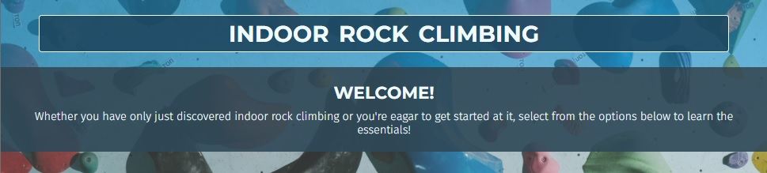

# Indoor Rock Climbing

Indoor Rock Climbing is a website to introduce the three main disciplines of competition climbing; Bouldering, Lead Climbing and Speed Climbing, to anyone, from those who have only just heard of the sport to those eager to give it a go. Many people will have discovered the sport for the first time when it made it's debut Olympic appearance at Tokyo 2020. Whilst the climbs were impressive to witness, for most people, the air of mystery around the sport may have prevented them from thinking they could ever try it out for themselves. 

This site provides an insight into the rules, equipment and technical language involved in each of these three disciplines, designed to bring indoor rock climbing to anyone with an interest in the sport, as well as a brief look at its origins and some highlights from it's first Olympic appearance.


[Image made using <a href = "http://ami.responsivedesign.is/">Am I Responsive Website</a>]

## Contents [**to complete - will work once each section is complete**]
---

* [Initial Project Vision](https://github.com/mountaincharlie/project-one-rock-climbing#initial-project-vision)
* [Technologies](https://github.com/mountaincharlie/project-one-rock-climbing#technologies)
* [Features](https://github.com/mountaincharlie/project-one-rock-climbing#features)
* [Pages](https://github.com/mountaincharlie/project-one-rock-climbing#pages)
* [Responsiveness](https://github.com/mountaincharlie/project-one-rock-climbing#responsiveness)
* [UXD](https://github.com/mountaincharlie/project-one-rock-climbing#uxd)
* [Accessability](https://github.com/mountaincharlie/project-one-rock-climbing#accessability)
* [Other Feature Ideas](https://github.com/mountaincharlie/project-one-rock-climbing#other-feature-ideas)
* [Testing](https://github.com/mountaincharlie/project-one-rock-climbing#testing)
* [Deployment](https://github.com/mountaincharlie/project-one-rock-climbing#deployment)
* [Credits](https://github.com/mountaincharlie/project-one-rock-climbing#credits)
* [Site Expansion Ideas](https://github.com/mountaincharlie/project-one-rock-climbing#site-expansion-ideas)

## Initial Project Vision [**to complete**] {#initial-project-vision}
---

* wireframes screen shots


* basic explanations for ideas

The colours and layouts for each page just to distinguish the different sections and show how the content could be arranged. 

## Technologies Used [**to complete**]
---

* HTML5
* CSS

## Features [**to complete**]
---

### The Homepage

* Header logo and Welcome banner




Done:
* The header in each of the 3 information pages is fixed so that the logo and nav menu stay at the top of the page as the user scrolls
* The heading in the top left corner of each information page is also a clickable link back to the homepage
* The information pages each have a fixed set of links in the bottom right hand corner which stays in this position as the user scrolls. The initial styling is set so that it is visible enough but doesnt distract from the page content. Once hovered over, the links are styled so that their text and background colours invert making them more visually obvious (also contributes to user interactivity/UXD)

To Do:
* homepage
* header
* footer
* navigation
* main background
* 3 main menu items
* 3 main info pages (their images, videos, links, navs)
* contact/newsletter form
* site credits (new tab? with links to new tabs)
* about the author
* social media links (new tab)

## Pages [**to complete**]
---

### Homepage 
* Description: The landing page for the website has a clear logo, colourful but not distracting background image, and an explanatory/welcome paragraph for the user. Below there is the main navigation section with links to the three informational pages. The footer contains links for the 'Chat With US!' contact form and Site Credits page on the left and the INstagram, Facebook and Twitter social media links on the right.  
* Purpose: To draw the user's attention, inform them of the site's purpose and how to navigate and to make its simple for the user to start navigating the pages right away.

### Background 
* Description:
* Purpose: 

### The Three Main Disciplines 
* Description:
* Purpose:

### As Seen At Tokyo 2020 
* Description:
* Purpose:

### Chat With Us! 
* Description:
* Purpose:

### Thank You! 
* Description: A page the user is take to after filling in the contact form 
* Purpose: To thank the user for engaing, so they feel acknowledged and to prompt them to keep using the website.

### Site Credits 
* Description:
* Purpose:

## Responsiveness [**to complete**]
---

(note: using % heights/widths in CSS contribute to responsiveness)
* media queries 
* different screen sizes
* incl. screeenshots

## UXD [**to complete**]
---
Done:
* Used Google Fonts [add-link] to choose a main font which I liked the look of (Montserrat - Extra-light 200) and one that was recommended to pair with it (Roboto - Light 300) and imported them into my styles.css so that all of my html files with the style.css link can access these fonts. I later removed the pre-set weighting from the import link so that I would have more flexibilty with styling the font.
* Used Google Fonts [add-link] to choose Fira Sans to pair with Montserrat and imported all the none-italicised weights so that I had the flexibility to see which are most readable in different page sections.  
* Homepage background image:
    * Originally was a more close up image that was a bit dark and only a few colours.
    * Changed to the current image which is a lot lighter and even though there are a few more colours, I feel that no part of the image particularly draws the user's attention away from the main text and navigation.
    * I used the linear-gradient CSS property to create a semi-transparent layer over the image in order to make the text and navigation ontop stand out a bit more.
    * I tried using tinyPNG [add-link] and tinyJPEG [add-link] to reduce the size of the image, but when testing the reduced images I did feel that the quality of the image suffered a bit on larger screens so I decided to keep the full size image which is less than 500kb anyway. 
* Colour scheme: while experimenting with what colours looked nice with my homepage background image, I found that the dark blue #2F4858 worked well and used <a href = "https://mycolor.space/?hex=%23845EC2&sub=1">ColorSpace</a> to find some other colours which worked with it. I ended up choosing from the reccomended Natural Palette; bright blue #00A0F3 and off-white #F1FBFF as nice complements to use throughout my pages' different features and highlihighlightsgths.
* Adding the CSS transition-duration and transition-timing-function properties to make some of the hover effects smoother and a better experience for the user.

### Styling ...
* colour
* fonts
* icons (continuity)
* consistent page structure for the 3 info pages and same footer across all and same header for all bu the homepage, but the homepage main logo matches the one on the header LHS.

### Interactivity ...
* info-tiles
* social media
* form (ask/suggest/hear)
* hover highlight effects
* hover main-nav effect
* CSS transition-duration and transition-timing-function properties
* no autoplay on the video

## Accessability [**to complete**]
---

Done: 
* Added aria-labels to the footer social media links (read about on: <a href = "https://www.w3.org/WAI/WCAG21/Techniques/aria/ARIA8.html">Using aria-label for link purpose</a>)
* Added the alt attribute to the img element for social media icons for better accessibility for screen readers and so that some text will be displayed if the image fails to load for some reason.
* Changed homepage navigation buttons into anchor element links after researching which would be best from an accessability point of view. The <a href = "https://www.youtube.com/watch?v=OmoCfODeBTA">Stop Using Buttons as Links</a> Youtube video by Steve Griffith explains how the button and anchor elements can be styled to look identical and work the same with other languages such as JavaScript, but there is actually more inbuilt accessability with anchor elements, if you are using it for the purpose of linking to another part of the page or openeing a new page, such as opening in new tabs/incognito tabs/windows.
* Added the main element around the main content of each page (except for the homepage whose main content is the nav element which cannot be placed inside the main element) for better screen reader accessability.
* Used the <a href = "https://www.w3.org/WAI/PF/HTML/wiki/RoleAttribute">RoleAttribute</a> W3 webpage to learn about the role attribute and some of the values it can have for elements which don't have specific semantic value. So in order to increase the accessability of my website I added:
    * The role = "note" attribute to my Safety First message on my The Three Main Climbign Disciplines page and on the background page paragraph which prompts the user to get in contact if they think I've missed something on the site. This was because these paragraphs were designed to act more as 'side notes' to the main content.
    * The role = "navigation" to the div elements in my footer, which I needed to use in order to float the lists of links to the left and right of the footer, along with the aria-label = "Footer links to contact form or site credits" (for the left div) and aria-label = "Footer links to social media pages" (for the right div).
    * A div around the list of viewport fixed links I have fixed to the lower right hand side so that I could use the role = "navigation" aria-label = "Links to page top or homepage" attributes.
* Used the <a href = "https://www.digitala11y.com/definition-role/">WAI-ARIA: Role=Definition</a> Digital A11Y webpage to learn how the role = "definition" attribute can be used the aria-labelledby attribute for definitions, so I applied this to my info-tiles in my Background and The Three Main Climbing Disciplines pages by:

```
<div aria-labelledby = "term-id">
    <h5 id = "term-id">'term title'</h5>
    <p role = "definition" aria-labelledby = "term-id">
        'definition wording'
    </p>
</div>
```

## Other Feature Ideas [**to complete**]
---

Some other feature ideas, which I didn't have time to implement.

### Fixed navigation links:
Like the 3 icon links for the Bouldering, Lead Climbing and Speed sections on my The Three Main Climbing Disciplines page, it would be nice to add these extra navigation features on the Background and As Seen At Tokyo 2020 pages. 

### Icons for the TOP and HOME links:
To give some more uniformity with the icons on my The Three Main Climbing Disciplines page, it would be nice to replace the TOP and HOME fixed-links with icons like an up arrow for TOP and a house for HOME.

### Images for the equipment required:
Having pictures of the equipment such as the climbing shoes and harnesses could help users who haven't seen the equipment make sense of it more in their head. 

### Videos for the equipment required: 
Videos could be used to demonstrate how to use the climbing equipment and/or to show some best practices in rock climbing.

### Paraclimbing page:
Include a page about paraclimbers; more information on accessability for different people in climbing, about casual and competative paraclimbing and the possibility of it making an apperance in a later Paraolympics.

## Testing [**to complete**]
---

### HTML & CSS validator warnings and fixes:
* [19-10-21] 1st testing index.html in WC3 markup validator indicated:
    * that I had section elements without headings, which led me to create the welcome h2 heading for the #welcome-para section and to realise that my main-nav nav element did not need to be within a section element.
    * that I had anchor elements within button elements, which led me to research buttons vs anchor elements from an accessability point of view and to ulitmately change the buttons to just be anchor element links (as explained in the Accessability section).
* [29-10-21] tested my background.html file after adding role = "section" to the divs of my info-tiles, but this came back as a bad request and checking the <a href = "https://developer.mozilla.org/en-US/docs/Web/Accessibility/ARIA/roles/section_role">Aria: Section Role</a> page on MDN Web Docs highlighted to me that role = "section" shouldn't be used, so I used the aria-labelledby attribute as explained in the Accessability section.

### Bugs and Fixes:
* [21-10-21] couldn't get the font-weight property to work for my Monserrat and Roboto Google Fonts. 
    * Solution: After searching through the Google Fonts site I realised I needed to import all of the font weights that I wanted to use in my website, so I imported a number that I wanted to try.  
* [24-10-21] on larger screens some of my pages which didn't have a lot of content ment that the footer was not at the bottom of the viewport. 
    * Solution: I created a CSS class with min-height = 100vh and applied it to the main element of each page (nav element for the homepage) so that the main content of each page adapts to have a minimum height which allows it to fill the viewport on any screen size.
* [24-10-21] I had been using some styled div elements as 'buffers' for all the pages which have the fixed header, so that the header wouldn't cover content when it shouldn't. But this was a bit messy and more of a 'hack'.
    * Solution: I learnt from Abbey Fitzgerald's article on <a href = "https://getflywheel.com/layout/create-sticky-website-header-how-to/">How to create a sticky website header</a> that I could adjust the body of the page with the css property padding-top with a value equal to the height of the fixed header.
* [29-10-21] after running Lighthouse in Google Dev Tools, it warned that the fixed-link words in blue did't have an appropriate contrast to the white background.
    * Solution: so I changed these to be the same colour as the icons (#2f4858) 


### Unfixed bugs
No unfixed bugs.

## Deployment [**to complete**]
---

* describe process to deploy to GitHub Pages
* live site link

## Credits [**to complete**]
---
Done: [add to Site Credits page]

External Code:
* Using the Flexbox method to centralize content horizontally **and** vertically <a href = "https://stackoverflow.com/questions/5703552/how-can-i-center-text-horizontally-and-vertically-inside-a-div-block" >(Josh Crozier's Approach 2 - Flexbox method)</a>
* Using rel="noopener noreferrer" for all anchor elements as Google's Dev Tools recommended this and <a href = "https://stackoverflow.com/questions/57628890/why-people-use-rel-noopener-noreferrer-instead-of-just-rel-noreferrer">Azametzin</a>  explains that some browsers may not support rel="noopener" and that there is no good reason to not include these values for the rel attribute.
* Using Rita Łyczwek's guide for creating a <a href = "https://www.flynerd.pl/2018/06/jak-napisac-dobre-readme-projektu-na-githubie.html">Table of Contents</a> section in this README file. 
* Using Abbey Fitzgerald's article on <a href = "https://getflywheel.com/layout/create-sticky-website-header-how-to/">How to create a sticky website header</a> to find out that I could adjust the body of the page with the CSS property padding-top with a value equal to the height of the fixed header, instead of using a div element as a 'buffer' to stop the fixed header covering content.
* Using and editing (to only keep the attributes i wanted, and explaining in the code why I kept the ones I did) the embedded code from YouTube's <a href = "https://youtu.be/QUqRIUKBFTk">How will the Olympics change sport climbing?</a> video so that the views from my site would contribute to the YouTube views for the video.

Page Styling:
* Finding that the Google Font Fira Sans paired well with Montserrat from <a href = "https://www.figma.com/google-fonts/montserrat-font-pairings/">Montserrat Font Pairing</a>
* Using Google Fonts <a href = "https://fonts.google.com/specimen/Montserrat">Montserrat</a> and <a href = "https://fonts.google.com/specimen/Fira+Sans">Fira Sans</a>
* Colour scheme from My Color Space: <a href = "https://mycolor.space/?hex=%232F4858&sub=1">Natural Palette</a>

Icons:
* Using social media icons from Icons8:
    * <a href="https://icons8.com/icon/84884/instagram">Instagram icon by Icons8</a>
    * <a href="https://icons8.com/icon/84872/facebook">Facebook icon by Icons8</a>
    * <a href="https://icons8.com/icon/84938/twitter">Twitter icon by Icons8</a>
* Using icons for my homepage main navigation menu from Icons8:
    * <a href="https://icons8.com/icon/61752/order-history">Order History icon by Icons8</a>
    * <a href="https://icons8.com/icon/-oxziy4sBdXf/climbing-wall">Climbing Wall icon by Icons8</a>
    * <a href="https://icons8.com/icon/5111/olympic-rings">Olympic Rings icon by Icons8</a>
* Using icons for my The 3 Main Climbing Disciplines page from Icons8:
    * <a href="https://icons8.com/icon/9800/drawstring-bag">Drawstring Bag icon by Icons8</a>
    * <a href="https://icons8.com/icon/9809/harness">Harness icon by Icons8</a>
    * <a href="https://icons8.com/icon/19099/time">Time icon by Icons8</a>
* Using an icon for my little disclaimer message about the risks of climbing from Icons8 :
    * <a href="https://icons8.com/icon/_lUhJoHVhm18/important-event">Important Event icon by Icons8</a>

Videos and Images:
* YouTube video added to the First Olympic Appearance section on the As Seen At Tokyo 2020 page:
     * <a href = "https://youtu.be/QUqRIUKBFTk">How will the Olympics change sport climbing?</a>
* Homepage background image: <a href = "https://www.pexels.com/photo/girl-in-blue-and-brown-dress-standing-on-multi-colored-heart-shaped-blocks-6700629/">by cottonbro on Pexels</a>
* IFSC images added to the Sport Climbing Medalists section on the As Seen At Tokyo 2020 page:
    * <a href = "https://www.flickr.com/photos/ifsclimbing/51369358028/">Janja Garnbret at the Tokyo 2020 Olympics by Dimitris Tosidis/IFSC</a>
    * <a href = "https://www.flickr.com/photos/ifsclimbing/51357817919">Miho Nonaka at the Tokyo 2020 Olympics by Dimitris Tosidis/IFSC</a>
    * <a href = "https://www.flickr.com/photos/ifsclimbing/51357381063/">Akiyo Noguchi at the Tokyo 2020 Olympics by Leo Zhukov/IFSC</a>
    * <a href = "https://www.flickr.com/photos/ifsclimbing/51360129665/">Alberto Ginés López at the Tokyo 2020 Olympics by Dimitris Tosidis/IFSC</a>
    * <a href = "https://www.flickr.com/photos/123572206@N08/51359121591">Nathaniel Coleman at the Tokyo 2020 Olympics by Dimitris Tosidis/IFSC</a>
    * <a href = "https://www.flickr.com/photos/ifsclimbing/51359884554/">Jakob Schubert at the Tokyo 2020 Olympics by Leo Zhukov/IFSC</a>

Page content:
* The Olympic medalists' information from the <a href = "https://www.ifsc-climbing.org/index.php/olympic-games/tokyo-2020">Olympic Games Tokyo 2020 page</a> on IFSC's website
* The <a href = "https://olympics.com/ioc/faq/olympic-symbol-and-identity/what-is-the-olympic-motto">Olympic motto</a>
* Information for when rock climbing was first thought to have been recognised as a sport from <a href = "https://en.wikipedia.org/wiki/History_of_rock_climbing#19th_century">Wikipedia - The History Of Rock Climbing</a>
* Information for when the first indoor rock climbing gym was built from <a href = "https://www.climbing.com/places/the-state-of-climbing-gyms-in-2018/">Climbing.com</a>

To Do:
* mention the Site Credits page which is on the site 
* links to things you borrowed from/were inspired by
    * content (text/icons)
    * features (things in css or functions on the site)
    * media (photos/videos)

##  Site Expansions Ideas [**to complete**] 
---

### Find a gym near you function:
Using Google Maps inside the website so the user can type in their location and what type of climbing they would like to try and would show them the best matches in their area and a way for the user to click a link to the website of the climbing gym(s) they discover.

(different to Other Feature Ideas)

* social media aspect for climbers to get in contact with eachother 
* a way to recommend gyms for user to visit based on their location, distance/travel preferences etc (with links to the gym's site)
* basic 'game' (climb-through) type quiz where you work your way up a climbing wall answering different questions about things learnt on the site (rules, technique, equipment, saftey...)
* actual newsletter 
    * updates from different gyms
    * general climbing news 
    * section for answering questions users send in
* blogs for users to contribute to (monitored) and/or written by the site owner
* advertising for climbing equipment and places to climb 