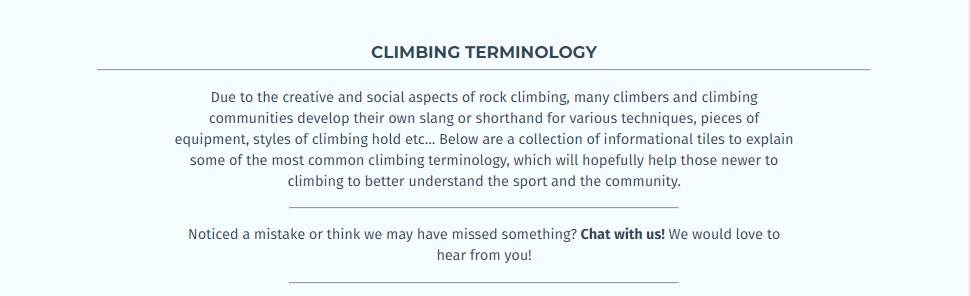
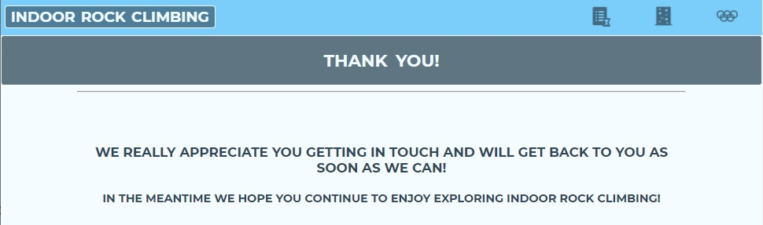

# Indoor Rock Climbing

Indoor Rock Climbing is a website to introduce the three main disciplines of competition climbing; Bouldering, Lead Climbing and Speed Climbing, to anyone, from those who have only just heard of the sport to those eager to give it a go. Many people will have discovered the sport for the first time when it made it's debut Olympic appearance at Tokyo 2020. Whilst the climbs were impressive to witness, for most people, the air of mystery around the terminology and techniques in the sport may have prevented them from thinking they could ever try it out for themselves. 

This site provides an insight into the rules, equipment and technical language involved in each of these three disciplines, designed to bring indoor rock climbing to anyone with an interest in the sport, as well as a brief look at its origins and some highlights from it's first Olympic appearance.


[Image made using <a href = "http://ami.responsivedesign.is/">Am I Responsive Website</a>]

## Contents [**to complete - will work once each section is complete**]
---

* [Technologies Used](https://github.com/mountaincharlie/project-one-rock-climbing#technologies-used)
* [Pages and Features Breakdown](https://github.com/mountaincharlie/project-one-rock-climbing#pages-and-features-breakdown)
* [Responsiveness](https://github.com/mountaincharlie/project-one-rock-climbing#responsiveness)
* [User Experience Design](https://github.com/mountaincharlie/project-one-rock-climbing#user-experience-design)
* [Accessability](https://github.com/mountaincharlie/project-one-rock-climbing#accessability)
* [Testing](https://github.com/mountaincharlie/project-one-rock-climbing#testing)
* [Deployment](https://github.com/mountaincharlie/project-one-rock-climbing#deployment)
* [Credits](https://github.com/mountaincharlie/project-one-rock-climbing#credits)
* [Site Expansion Ideas](https://github.com/mountaincharlie/project-one-rock-climbing#site-expansion-ideas)

## Technologies Used [**to complete**]
---

* HTML5
* CSS

## Pages and Features Breakdown [**to complete**]
---

### The Homepage

* Header logo:
    * Clearly discribes the topic of the website.
* Welcome banner:
    * Introduces the user to the site's purpose and how to use the site.


* Main Navigation: 
    * Found below the Welcome banner and is the primary feature of the homepage.
    * Contains links to the 'Background', 'The 3 Main Climbing Disciplines' and 'As Seen At Tokyo 2020' informational pages with icons related to the page headings.
* Background image:
     * Draws the attention of the user as its colourful but the white linear-gradient placed over it means it doesn't distract from the page content. 


* Footer:
    * The left hand side contains links to the 'Chat With Us!' contact form and the 'Site Credits' page, which open up within the same tab.
    * The right hand side contains links to the Instagram, Facebook and Twitter social media pages, which open up in a new tab. 


### The Three Informational Pages

* Fixed header:
    * Has a background colour matching that homepage header for consistency.
    * The left hand side contains the logo matching the homepage header logo, which also acts a link to the homepage.
    * The right hand side contains the navigation between the 3 informational pages, using icons which are consistent with the homepage navigation and are coloured white when the user is on that page.
    * Is fixed to the top of the viewport so that as the user scrolls they still have easy access to the pages navigation and logo which links to the homepage.
* Page heading:
    * Contains the page heading and icon consistent with the header and homepage navigations.


* Fixed navigation:
    * Is fixed to the lower right hand side of the page so that as the user scrolls they have easy access to links to the top of the page and to the homepage.


### The Background page

* The Brief Background of Rock Climbing section:
    * Uses the What?/When?/Who?/How/Where?/Why? questions to cover the basic background of rock climbing in a logical order.


* The Climbing Terminology section:
    * Explains briefly about the terminology/slang in the climbing community, which is an aspect of the sport that can be confusing for those who are new to it.
    * Contains four subsections which catagorise the most common climbing terminology to make it easer for the user to explore the different terms.



* Terminology subsections:
    * Cover four catagories; Climbing Holds, Types of Climbing Walls, Climbing Technique and Competition Specific
    * Contain an explanation for the subsection catagory and explain that the user should hover over/tap on the informational tiles to find out the defintions for each term.
    * Contain informational tiles, which expand and change colour when the user hovers over it on a desktop or taps it on a smart phone, to provide the term's definition.


### The 3 Main Climbing Disciplines page

* The 3 main sections:
    * Contain the same subsections structure; Discipline Overview, Equipment Needed and How To, for the 3 disciplines; Bouldering, Lead Climbing, Speed Climbing, in the order which they are most accessible to new climbers.

* The Discipline Overview subsection:
    * Contains a description of the particular discipine and a Safety First warning to remind the user that there are risks involved with the sport and they should pay attention to gym staff's advice.


* The Equipment Needed subsection:
    * Contains explanatory text informing the user should hover over/tap on the informational tiles to find out the explanations for each piece of equipment.
    * Contains informational tiles, relevant to each discipline, which expand and change colour when the user hovers over it on a desktop or taps it on a smart phone, to provide an explanation for the piece of equipment.


* The How To subsection:
    * Contains an ordered list of instructions on the steps to completing a climbing route/problem for each discipline.


* Page specific fixed navigation:
    * Is fixed to the lower right hand side of the page so that as the user scrolls they have easy access to links to the top of the page and to the homepage.
    * Also contains links to jump to each of the 3 disciplines, using icons which are consistent with those in the section headings for each discipline.


### The As Seen At Tokyo 2020 page

* The First Olympic Apperance section:
    * Contains a short embedded YouTube video from the Olympics offical YouTube account about the sport's first olympic appearance.
    * Contains a blockquote for the english translation of the Olympic Motto which is mentioned at the end of the YouTube video.  
    * Contains a short paragraph about what it meant for the climbing community to have their sport in the Olympics for the first time.


* The Sport Climbing Rules and Scoring section:
    * Contains subsections for how the rules and scoring works in sport climbing.


* The Rules subsection:
    * Contains an explanation of how the basic rules of the disciplines are the same as in casual climbing and includes the 5 competition specific rules for each discipline. 


* The Scoring subsection:
    * Explains how the overall scoring works and then breaks down how the athletes are scored and ranked in each discipline, in the order that the disciplines are held. 


* The Sport Climbing Event Structure section:
    * Contains subsections explaining the location and the number of atheletes who entered/progressed for each of the three stages; Qualifying For The Olympics, Qualifying For The Olympic Finals and The Olympic Finals.


* The Sport Climbing Medalists section:
    * Contains subsections for the Women's and Men's catagories, with the althetes who were awarded medals arranged horizontonally in podium order; silver, gold, bronze, from left to right.
    * Each medalist section has the athelete's medal position, name, an image of them from the Olympics with a circular, coloured border and a clickable link to the photo credit.
 


### The Chat With Us! Form

* Contains 3 fieldsets for; the user's details, optional ways for the user to contact us, optional newsletters for the user to sign up for.
    * The user's details are required inputs for the form and will prompt the user to enter a correct name/email address if they try to submit without.
    * There are radio inputs for the optional contact so that the user can submit a question or suggestion and this allows us to catagorise what kind of contact the user is making.
    * There are tickbox inputs for the optional newsletter signups so the user can choose which specific newsletters they may want to sign up to.  
* Contains a 'LET'S GO!" submit input to submit the form and a 'START AGAIN' reset input to reset the form.


### The Thank You! Page

* Contains a thank you message for the user and a prompt to keep enjoying the website (this page has the same fixed navigation links for the page top and homepage as the other pages).
* There is no link navigation to this page, it is only reached when the user submits the form.



### The Site Credits Page

* Contains 2 sections; Content and Media.
    * The Content section contains subsections; Text, Styling/Features and Icons, with clickable links to the appropriate credits, which open in a new tab. 
    * The Media section contains subsections; Photos and Videos, with clickable links to the appropriate credits, which open in a new tab.


## User Experience Design [**to complete**]
---

In order for users to have a good experience while using the website, I followed the user centered design process, making sure to consider the usefulness, usability and value of different features of the site and that they were intuative, simple and enjoyable.  

### Styling 
* Colour scheme: 
    * While experimenting with what colours looked nice with my homepage background image, I found that the dark blue #2F4858 worked well and used <a href = "https://mycolor.space/?hex=%23845EC2&sub=1">ColorSpace</a> to find some other colours which worked with it. I ended up choosing from the reccomended Natural Palette; bright blue #00A0F3 and off-white #F1FBFF as nice complements to use throughout my pages' different features and highlights.


* Fonts:
    * Used Google Fonts to choose <a href = "https://fonts.google.com/specimen/Montserrat">Montserrat</a> for my headings and <a href = "https://fonts.google.com/specimen/Fira+Sans">Fira Sans</a> to pair with it for the rest of the text on the pages. For both of these fonts I imported all the none-italicised weights into my style.css file, so that I had the flexibility to use different font-weights. By importing them into my styles.css file, all of my html files with the style.css link could access these fonts.
 
* Icons: 
    * In order to have a consistent feel across my icons I chose to use them all from <a href = "https://icons8.com/">Icons8</a> as they had the best range of rock climbing related icons.
    * My primary use for the icons was for the user to be able to instantly recognise which icons in the navigation related to which pages within the site.
    * The icons also provided a way to have navigation sections and links to social media which didn't need to have written links and gave it a clearer, simplified look. 
    * Icons8 icons were included into the code via the img element, so I made sure to include descriptive alt attributes to each of them for screen readers and incase there were any issues loading them.  

* Continuity across the pages:
    * I kept the footer exactly the same through all the pages.
    * Apart from the homepage, I used the same fixed header with logo and navigation, but the logo and the navigation icons were consistent with those on the homepage.
    * I used CSS classes to style the layout, fonts, sizes of all the sections and subsections on each page.

* Homepage background image:
    * Originally, I was using a more close up image that was a bit dark and only had a few colours.
    * But then I changed to the current image which is a lot lighter, doesn't have a particular subject that draws too much attention and includes a few more colours, without dominating the page or distracting from the main text and navigation.
    * I used the linear-gradient CSS property to create a semi-transparent, white layer over the image in order to make the text and navigation ontop stand out even more.
    * I tried using <a href = "https://tinypng.com/">tinyPNG</a> and <a href = "https://tinyjpg.com/">tinyJPEG</a> to reduce the size of the image, but when testing the reduced images I did feel that the quality of the image suffered a bit on larger screens so I decided to keep the full size image, which is still less than 500kb anyway, in order to preserve the quality of the image. 

### Interactivity

* Info-tiles:
    * Are used on the Background page in order to provide explanations for climbing terms and on the The Three Main Climbing Disciplines page for more information on the equipment needed for each discipline. 
    * Change colour on opening to make them stand out on the page and amongst the other tiles.
    * Provide a way to have less text on the screen at any one time which makes the page visually less busy and more pleasing for the user.
    * Are grouped logically to help users find specific terms/equipment more quickly and easily.
    * Give the user the ability to choose which explanations/definitions they look at, for example some users may only wish to look at certain terms/equipment if they already have knowledge of others or may want to find the definition of a particular term they have heard, without having to scroll through many other definitions.


* Social Media:
    * Links included on the right hand side of the footer and open in a new tab so that they don't replace the website in the current tab.
    
* Contact form:
    * Enables the user to input their name/email address and prompt correct input if the user tries to submit the form while these are not entered correctly.
    * Gives the user the option to make a suggestion or ask a question and provides a textarea element for them to type in.
    * Gives the user a choice of optional newsletters which they can choose to recieve. 
    
* CSS :hover Pseudo Class, used to:
    * Hghlight the homepage logo, by changing its background colour from grey to blue, increasing the letter spacing.
    * Highlight the items in the homepage main navigation, by changing their background colour from blue to grey, increasing the border-radius from 4px to 8px and increasing the letter spacing.
    * Highlight the icons for the three informational pages in the fixed header, by changing the background colour to white, or grey if the icon represents the current page.
    * Highlight the logo in the left hand side of the fixed header, by changing the background colour from grey to blue and increasing the letter spacing.
    * Highlight; the Chat With Us! form, Site Credits Page and social media links in the footer, by changing the background colour to a light blue and border-radius from 4px to 8px when hovered over.
    * Uncover further information for the Info-tiles, by changing the paragraph element's overflow CSS property from hidden to auto. 
    * Highlight the form's fieldsets and submit/reset inputs when hovered over, by changing the text and border colour from grey to blue.
    * Highlight the Olympic medalists' image borders, by changing the thickness from 3px to 8px as the user hovers over them.
    
* Embedded video:
    * Has no autoplay allowed, to prevent bad user experience when they arrive at the page.
    * Has YouTube controls for the user to pause/play, change the volume and allow fullscreen mode.

## Accessability [**to complete**]
---

In order to make the website more accessible, for those who rely on screen readers, I made sure that I used used semantic HTML elements to create the structure on all of my pages and where this wasn't possible, I made sure to implement other techniques to increase the accessibility of the site for the use of screen readers.

### Semantic elements

*  I changed my homepage navigation buttons into anchor element links after researching which method would be best from an accessability point of view. The <a href = "https://www.youtube.com/watch?v=OmoCfODeBTA">Stop Using Buttons as Links</a> Youtube video by Steve Griffith explains how the button and anchor elements can be styled to look identical and work the same with other languages such as JavaScript, but there is actually more inbuilt accessability with anchor elements, if you are using it for the purpose of linking to another part of the page or opening a new page, such as opening in new tabs/incognito tabs/windows.
* I added the main element around the main content of each page for better screen reader accessability.

### Aria-labels

* I added aria-labels to internal and external links after reading W3's page about <a href = "https://www.w3.org/WAI/WCAG21/Techniques/aria/ARIA8.html">Using aria-label for link purpose</a>.
* I added aria-labels to the submit/rest inputs in the contact form as the text displayed on them; 'LET'S GO!' and 'START AGAIN' might not have been descriptive enough.

### Attributes

* I added the alt attribute to the img element for all of the Icons8 icons and Olympic medalists' images I used, for better accessibility for screen readers and so that some text will be displayed if the image fails to load for some reason.
* I used W3's <a href = "https://www.w3.org/WAI/PF/HTML/wiki/RoleAttribute">RoleAttribute</a> webpage to learn about the role attribute and some of the values it can have for elements which don't have specific semantic value. So in order to increase the accessability of my website I added:
    * The role = "note" attribute to my Safety First message on my The Three Main Climbing Disciplines page and on the Background page paragraph which prompts the user to get in contact if they think I've missed something on the site. This was because these paragraphs were designed to act more as 'side notes' to the main content.
    * The role = "navigation" to the div elements in my footer, which I needed to use in order to float the lists of links to the left and right of the footer, along with the aria-label = "Footer links to contact form or site credits" (for the left div) and aria-label = "Footer links to social media pages" (for the right div).
    * A div around the list of viewport fixed links I have fixed to the lower right hand side of each page (besides the homepage) so that I could use the role = "navigation" aria-label = "Links to page top or homepage" attributes.
* Used the <a href = "https://www.digitala11y.com/definition-role/">WAI-ARIA: Role=Definition</a> Digital A11Y webpage to learn how the role = "definition" attribute can be used with the aria-labelledby attribute for definitions, so I applied this to my info-tiles in my Background and The Three Main Climbing Disciplines pages by:

```
<div aria-labelledby = "'term-id'">
    <h5 id = "'term-id'">'term title'</h5>
    <p role = "definition" aria-labelledby = "'term-id'">
        'definition wording'
    </p>
</div>
```

## Testing [**to complete**]
---

### HTML & CSS validator warnings and fixes
* [19-10-21] 1st testing index.html in WC3 markup validator indicated:
    * that I had section elements without headings, which led me to create the welcome h2 heading for the #welcome-para section and to realise that my main-nav nav element did not need to be within a section element.
    * that I had anchor elements within button elements, which led me to research buttons vs anchor elements from an accessability point of view and to ulitmately change the buttons to just be anchor element links (as explained in the Accessability section).
* [29-10-21] tested my background.html file after adding role = "section" to the divs of my info-tiles, but this came back as a bad request and checking the <a href = "https://developer.mozilla.org/en-US/docs/Web/Accessibility/ARIA/roles/section_role">Aria: Section Role</a> page on MDN Web Docs highlighted to me that role = "section" shouldn't be used, so I used the aria-labelledby attribute as explained in the Accessability section.

### HTML Validation in Offical W3C Validator

* No errors or warnings
* <a href = "https://validator.w3.org/nu/?doc=https%3A%2F%2Fmountaincharlie.github.io%2Fproject-one-rock-climbing%2F">Link to validator results</a>

### CSS Validation in Offical Jigsaw Validator

* No errors or warnings
* <a href = "https://jigsaw.w3.org/css-validator/validator?uri=https%3A%2F%2Fmountaincharlie.github.io%2Fproject-one-rock-climbing%2F&profile=css3svg&usermedium=all&warning=1&vextwarning=&lang=en">Link to validator results</a>

### Lighthouse Accessability score

 

### Bugs and Fixes
* [21-10-21] couldn't get the font-weight property to work for my Monserrat and Roboto Google Fonts. 
    * Solution: After searching through the Google Fonts site I realised I needed to import all of the font weights that I wanted to use in my website, so I imported a number that I wanted to try.  
* [24-10-21] on larger screens some of my pages which didn't have a lot of content ment that the footer was not at the bottom of the viewport. 
    * Solution: I created a CSS class with min-height = 100vh and applied it to the main element of each page (nav element for the homepage) so that the main content of each page adapts to have a minimum height which allows it to fill the viewport on any screen size.
* [24-10-21] I had been using some styled div elements as 'buffers' for all the pages which have the fixed header, so that the header wouldn't cover content when it shouldn't. But this was a bit messy and more of a 'hack'.
    * Solution: I learnt from Abbey Fitzgerald's article on <a href = "https://getflywheel.com/layout/create-sticky-website-header-how-to/">How to create a sticky website header</a> that I could adjust the body of the page with the css property padding-top with a value equal to the height of the fixed header.
* [29-10-21] after running Lighthouse in Google Dev Tools, it warned that the fixed-link words in blue did't have an appropriate contrast to the white background.
    * Solution: so I changed these to be the same colour as the icons (#2f4858) 


### Unfixed bugs
No unfixed bugs.

## Deployment [**to complete**]
---

### Deployment Process on GitHub
* I selected the Settings tab from within the project-one-rock-climbing repository 
* The selected the Pages tab within Settings
* Then chose Main from the Branch dropdown menu
* Finally, the page then provided the live link to my website and after a few minutes it was ready to be viewed

### Live website link
* <a href = "https://mountaincharlie.github.io/project-one-rock-climbing/">Indoor Rock Climbing</a>

## Credits [**to complete**]
---

External Code:
* Using the Flexbox method to centralize content horizontally **and** vertically <a href = "https://stackoverflow.com/questions/5703552/how-can-i-center-text-horizontally-and-vertically-inside-a-div-block" >(Josh Crozier's Approach 2 - Flexbox method)</a>
* Using rel="noopener noreferrer" for all anchor elements as Google's Dev Tools recommended this and <a href = "https://stackoverflow.com/questions/57628890/why-people-use-rel-noopener-noreferrer-instead-of-just-rel-noreferrer">Azametzin</a>  explains that some browsers may not support rel="noopener" and that there is no good reason to not include these values for the rel attribute.
* Using Rita Łyczwek's guide for creating a <a href = "https://www.flynerd.pl/2018/06/jak-napisac-dobre-readme-projektu-na-githubie.html">Table of Contents</a> section in this README file. 
* Using Abbey Fitzgerald's article on <a href = "https://getflywheel.com/layout/create-sticky-website-header-how-to/">How to create a sticky website header</a> to find out that I could adjust the body of the page with the CSS property padding-top with a value equal to the height of the fixed header, instead of using a div element as a 'buffer' to stop the fixed header covering content.
* Using and editing (to only keep the attributes i wanted, and explaining in the code why I kept the ones I did) the embedded code from YouTube's <a href = "https://youtu.be/QUqRIUKBFTk">How will the Olympics change sport climbing?</a> video so that the views from my site would contribute to the YouTube views for the video.

Research on Accessability:
* Using Web Accessibility Education's video <a href = "https://www.youtube.com/watch?v=38JDscMbB4I">What Are ARIA Attributes?</a> to learn about how the aria-labels and aria-labelledby can help accessability and when/how to use them. 
* Used W3's page on <a href = "https://www.w3.org/WAI/WCAG21/Techniques/aria/ARIA8.html">Using aria-label for link purpose</a> to learn how to add aria-labels to the footer social media links.
* Learnt from Steve Griffith's YouTube video <a href = "https://www.youtube.com/watch?v=OmoCfODeBTA">Stop Using Buttons as Links</a> to avoid using buttons as links to make the page make more sematical sense and improve accessability for those using screen readers.
* Used W3' webpage on <a href = "https://www.w3.org/WAI/PF/HTML/wiki/RoleAttribute">RoleAttribute</a> to learn about the role attribute and some of the values it can have for elements which don't have specific semantic value.
* Used Digital A11Y's webpage <a href = "https://www.digitala11y.com/definition-role/">WAI-ARIA: Role=Definition</a> to learn how the role = "definition" attribute can be used with the aria-labelledby attribute for definitions.

Page Styling:
* Finding that the Google Font Fira Sans paired well with Montserrat from <a href = "https://www.figma.com/google-fonts/montserrat-font-pairings/">Montserrat Font Pairing</a>
* Using Google Fonts <a href = "https://fonts.google.com/specimen/Montserrat">Montserrat</a> and <a href = "https://fonts.google.com/specimen/Fira+Sans">Fira Sans</a>
* Colour scheme from My Color Space: <a href = "https://mycolor.space/?hex=%232F4858&sub=1">Natural Palette</a>

Icons:
* Using social media icons from Icons8:
    * <a href="https://icons8.com/icon/84884/instagram">Instagram icon by Icons8</a>
    * <a href="https://icons8.com/icon/84872/facebook">Facebook icon by Icons8</a>
    * <a href="https://icons8.com/icon/84938/twitter">Twitter icon by Icons8</a>
* Using icons for my homepage main navigation menu from Icons8:
    * <a href="https://icons8.com/icon/61752/order-history">Order History icon by Icons8</a>
    * <a href="https://icons8.com/icon/-oxziy4sBdXf/climbing-wall">Climbing Wall icon by Icons8</a>
    * <a href="https://icons8.com/icon/5111/olympic-rings">Olympic Rings icon by Icons8</a>
* Using icons for my The 3 Main Climbing Disciplines page from Icons8:
    * <a href="https://icons8.com/icon/9800/drawstring-bag">Drawstring Bag icon by Icons8</a>
    * <a href="https://icons8.com/icon/9809/harness">Harness icon by Icons8</a>
    * <a href="https://icons8.com/icon/19099/time">Time icon by Icons8</a>
* Using an icon for my little disclaimer message about the risks of climbing from Icons8 :
    * <a href="https://icons8.com/icon/_lUhJoHVhm18/important-event">Important Event icon by Icons8</a>

Videos and Images:
* YouTube video added to the First Olympic Appearance section on the As Seen At Tokyo 2020 page:
     * <a href = "https://youtu.be/QUqRIUKBFTk">How will the Olympics change sport climbing?</a>
* Homepage background image: <a href = "https://www.pexels.com/photo/girl-in-blue-and-brown-dress-standing-on-multi-colored-heart-shaped-blocks-6700629/">by cottonbro on Pexels</a>
* IFSC images added to the Sport Climbing Medalists section on the As Seen At Tokyo 2020 page:
    * <a href = "https://www.flickr.com/photos/ifsclimbing/51369358028/">Janja Garnbret at the Tokyo 2020 Olympics by Dimitris Tosidis/IFSC</a>
    * <a href = "https://www.flickr.com/photos/ifsclimbing/51357817919">Miho Nonaka at the Tokyo 2020 Olympics by Dimitris Tosidis/IFSC</a>
    * <a href = "https://www.flickr.com/photos/ifsclimbing/51357381063/">Akiyo Noguchi at the Tokyo 2020 Olympics by Leo Zhukov/IFSC</a>
    * <a href = "https://www.flickr.com/photos/ifsclimbing/51360129665/">Alberto Ginés López at the Tokyo 2020 Olympics by Dimitris Tosidis/IFSC</a>
    * <a href = "https://www.flickr.com/photos/123572206@N08/51359121591">Nathaniel Coleman at the Tokyo 2020 Olympics by Dimitris Tosidis/IFSC</a>
    * <a href = "https://www.flickr.com/photos/ifsclimbing/51359884554/">Jakob Schubert at the Tokyo 2020 Olympics by Leo Zhukov/IFSC</a>

Page content:
* The Olympic medalists' information from the <a href = "https://www.ifsc-climbing.org/index.php/olympic-games/tokyo-2020">Olympic Games Tokyo 2020 page</a> on IFSC's website
* The <a href = "https://olympics.com/ioc/faq/olympic-symbol-and-identity/what-is-the-olympic-motto">Olympic motto</a>
* Information for when rock climbing was first thought to have been recognised as a sport from <a href = "https://en.wikipedia.org/wiki/History_of_rock_climbing#19th_century">Wikipedia - The History Of Rock Climbing</a>
* Information for when the first indoor rock climbing gym was built from <a href = "https://www.climbing.com/places/the-state-of-climbing-gyms-in-2018/">Climbing.com</a>


##  Site Expansions Ideas [**to complete**] 
---

Features that could be added to expand and improve the website in the future.

### Fixed navigation links for sections within the pages
* Like the 3 icon links for the Bouldering, Lead Climbing and Speed sections on my The Three Main Climbing Disciplines page, it would be nice to add these extra navigation features on the Background and As Seen At Tokyo 2020 pages. 

### Icons for the TOP and HOME links
* To give some more uniformity with the icons on my The Three Main Climbing Disciplines page, it would be nice to replace the TOP and HOME fixed-links with icons like an up arrow for TOP and a house for HOME.

### Images for the equipment required
* Having pictures of the equipment such as the climbing shoes and harnesses could help users who haven't seen the equipment make sense of it more in their head. 

### Videos for the equipment required
* Videos could be used to demonstrate how to use the climbing equipment and/or to show some best practices in rock climbing.

### Paraclimbing page
* Include a page about paraclimbers; more information on accessability for different people in climbing, about casual and competative paraclimbing and the possibility of it making an apperance in a later Paraolympics.

### Find a gym near you function
* Using Google Maps inside the website so the user can type in their location and what type of climbing they would like to try and would show them the best matches in their area and a way for the user to click a link to the website of the climbing gym(s) they discover.

### Site specific social media
* Social media aspect for climbers to get in contact with eachother, perhaps based on the gym they use. 

### 'Climb-through' quiz
* A basic quiz game where the user works their way up a climbing wall, in a 'climb-through' (as opposed to a walk-through), by answering different questions about things learnt on the site (rules, technique, equipment etc...).

### Actual newsletters 
* With
    * updates from different gyms
    * general climbing news 
    * a section for answering questions sent in by people

### Site blog
* For users to contribute to. With submissions being monitored before posting. 

### Advertising
* For climbing equipment, places to climb and events in the relevant sections of the website.

